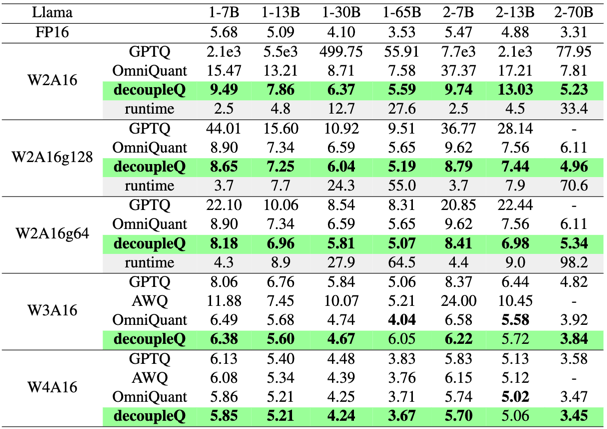

# decoupleQ: Towards 2-bit Post-Training Uniform Quantization via decoupling Parameters into Integer and Floating Points

This repository contains the code for decoupleQ, the paper link is https://arxiv.org/abs/2404.12759 

Some of the code in this repo is built on top of [OPTQ's repository](https://github.com/IST-DASLab/gptq). We sincerely thank OPTQ for their great contribution.
Please feel free to raise issues or contact guoyi.0@bytedance.com if you have any question.

## Dependencies
All of our experiments are conducted in the following environment.
* datasets==1.17.0
* transformers==4.35.0
* torch==2.1.0


## Reproduce
```
bash run_llama.sh # will get result 9.49 for wikiText2
bash run_resnet.sh # will get result 64.134 for ResNet-18
````
In llama quantization, if you find that the reproduced results (including the runtime) are far from the reported results, 
consider modifying the flag: `torch.backends.cuda.matmul.allow_tf32`. More details can be found in [here](https://pytorch.org/docs/stable/notes/cuda.html#tf32-on-ampere).


## Results
Here is a summary of LLama results:





## Cite

If you found this work useful, please consider citing: 
```
@misc{guo2024decoupleq,
      title={decoupleQ: Towards 2-bit Post-Training Uniform Quantization via decoupling Parameters into Integer and Floating Points}, 
      author={Yi Guo and Fanliu Kong and Xiaoyang Li and Hui Li and Wei Chen and Xiaogang Tian and Jinping Cai and Yang Zhang and Shouda Liu},
      year={2024},
      eprint={2404.12759},
      archivePrefix={arXiv},
      primaryClass={cs.LG}
}
```